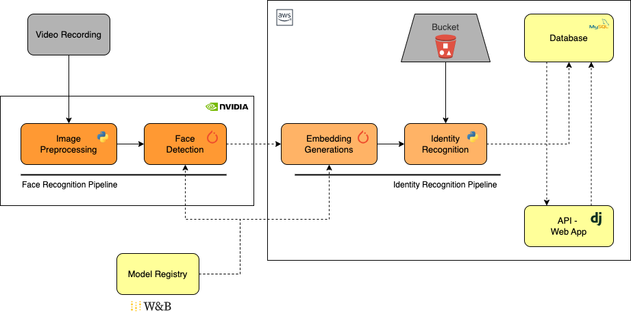

# Automatic Student Attendance Systems With Jetson Nano (Proof of Concept)

### A fully functional PROTOTYPE project written in Python to identify students using multiples CNNs (MTCNN for face detection and Inception-ResNetV1 for Embeddings Generation)


This project is PoF to automate the tedious and time consuming task of taking attendance, done by some Academic Institutions. All the part of this project combined aim to provide the following advantages:

* Minimize Accumulated Time Spent on Attendance Tracking
* Monitor Individual Student Class Attendance Duration
* Prevent Impersonation by Students
* Integrate with the Academic Management System (Not Implemented in This Project)

## Project Diagram


```shell
git clone https://github.com/MarianoPareja/Attendance-Control-System
pip install -r requirements.txt
```


## Tweak this project for you
This project is a prototype so there probably are some errors to be solve or improvements to be done. Anyway I'd encourage you to clone and use this code for your own purpose. 
It can be a good starter for bigger projects.

## Find a bug?
If you found an issue or would like to submit an improvement to this project, please submit an issue using the issues tab above. If you would like to submit a PR with a fix, reference the issue you created!
